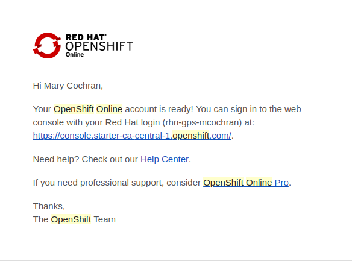
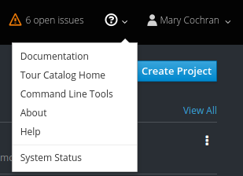
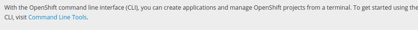
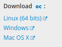

# Get an OpenShift Online Account

## Create Account

To create an OpenShift online account you will first need to have a rh developer account.
https://developers.redhat.com/auth/realms/rhd/protocol/openid-connect/registrations?client_id=web&redirect_uri=https%3A%2F%2Fdevelopers.redhat.com%2F%2Fconfirmation&state=2fcb17ca-3295-44eb-88d3-6c89851f1753&nonce=6aca0b15-7b68-42e0-858a-ad27f5c65983&response_mode=fragment&response_type=code&scope=openid 

Then go here to create your account: https://www.openshift.com/container-platform/

1. Select sign up for free

2. Select ‘Add a New Plan’, Free Plan

3. Wait for email

## Get OC Tools

To login to your Open Shift instance from you machine you will need to install oc utils. 

You can do so from here 
https://access.redhat.com/downloads/content/293/ver=3.3/rhel---7/3.3/x86_64/product-software
or by going to about section in web console.

1. Go to your webconsole, link similar to https://console.starter-ca-central-1.openshift.com/console/command-line
and select 'About' from the drop down when clicking the question mark. 

2. Select the 'Command Link Tools' link

3. Download the appropriate ‘oc’ tool for your operating system

### Optional
To use the 'oc' utilities without specifying the location of the file you can add the file to your PATH environment variable or if in a Linux/Unix OS you can move the file to a bin folder. 

In Fedora you could move it to /usr/local/bin/ for example. 

#### Windows Adding to Path
1. Start the System Control Panel applet (Start - Settings - Control Panel - System). You may have to select View --> Small Icons
2. Select the Advanced tab.
3. Click the Environment Variables button.
4. Under System Variables, select Path, then click Edit.
5. You'll see a list of folders, as this example for my system shows: C:\Program Files\Windows Resource Kits\Tools\;%SystemRoot%\system32;%SystemRoot%;%SystemRoot%\System32\Wbem;C:\Program Files\Support Tools\;C:\Program Files\Common Files\Roxio Shared\DLLShared;C:\Program Files\Common Files\Ulead Systems\MPEG;C:\Program Files\Intel\DMIX;C:\Program Files\Executive Software\Diskeeper\;C:\Program Files\Bonjour\;C:\Program Files\QuickTime\QTSystem\;C:\Program Files\Misc
6. You can add additional folders that you want to include in your path. Simply put "<folder to add>;" to the beginning of the PATH and click OK
7. You'll need to restart the command prompt to use the editted system path. 
