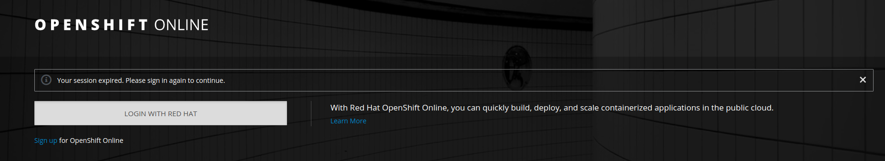
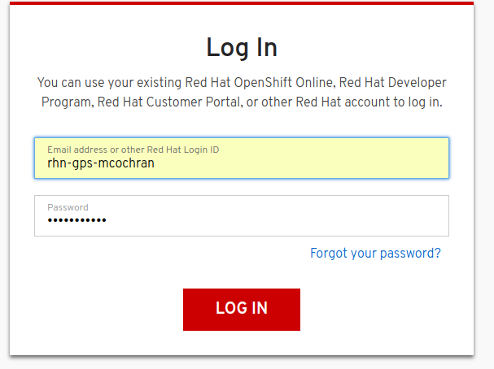
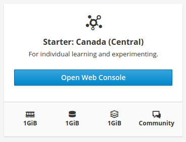
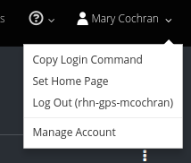
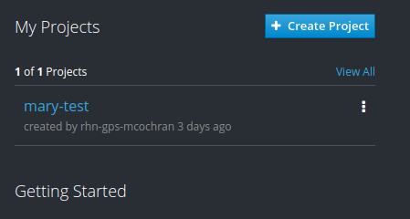
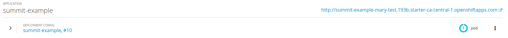

# Deploy Your Route to OpenShift

This lab assumes you have an Open Shift Online free account.  If you do not, please go to Step 00 here: https://github.com/mmistretta/RHSummit2018Camel3ScaleLab/tree/master/00-create-openshift-online-account


        


1. Go to https://manage.openshift.com/ and login using RH Developer Credentials



2. Click link to go to OpenShift Management Console



3. Upper right hand corner <copy login command>
  
```
[marycochran@localhost RHSummit2018Camel3ScaleLab]$ oc login https://api.starter-ca-central-1.openshift.com --token=<MYTOKEN>
Logged into "https://api.starter-ca-central-1.openshift.com:443" as "rhn-gps-mcochran" using the token provided.

You have one project on this server: "mary-test"

Using project "mary-test".
```
  
4. Go to terminal window and paste the copied oc login command

5. Creating a new project (if you do not already have 1, if you have one use that) using 'oc new-project <yourName>-RHSummit2018-project'

6. Browse to Camel project in terminal

<TODO insert text from end of output for fabric8:deploy> 

7. Run ‘mvn fabric8:deploy’ in terminal 



8. From your openshift console Select your project



9. Copy the link in the top right hand corner of your application listing

```
curl http://summit-example-mary-test.193b.starter-ca-central-1.openshiftapps.com/camel/hello
```

10. Paste this url + '/camel/hello' or whatever path you chose into a browse and hit enter or did a curl request
```json
{"response":"Hello World","name":"your name"}
```
11. You should see a nice json response the same way you did locally
