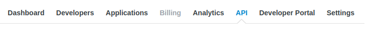
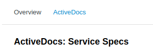
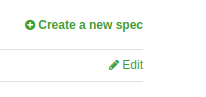
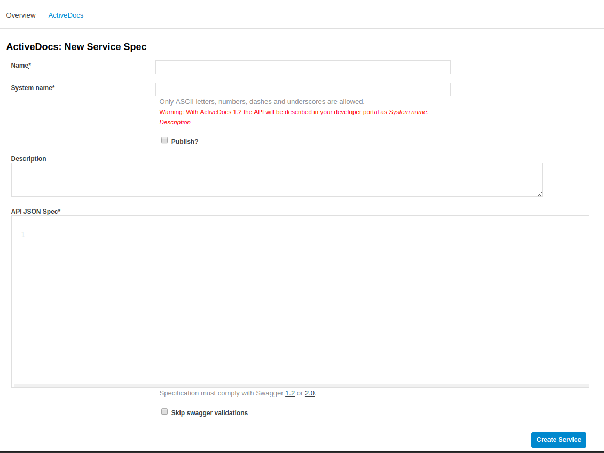
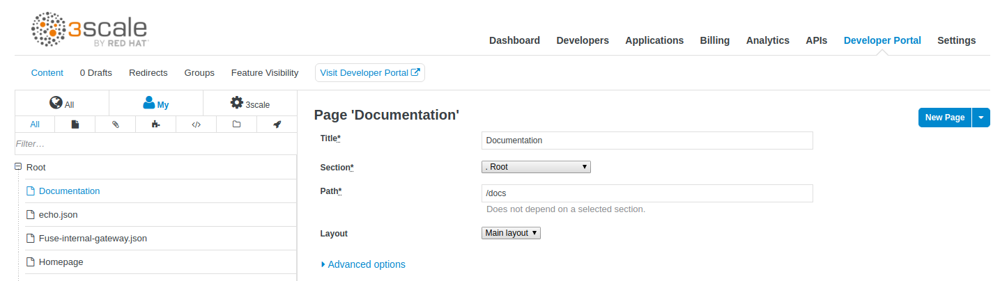
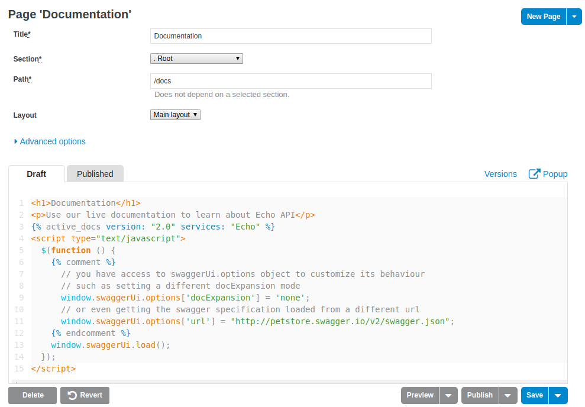
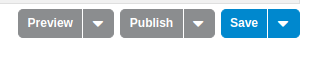
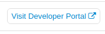

# Adding Swagger API documentation to Camel

This is a bonus exercise where we briefly explore how you can enable Swagger API documentation
to your Camel RESTful services. 

## Code first vs Contract first

This example uses the _code first_ style, where the API is coded first and then the API documentation is generated from the source code.

The other approach would be _contract first_ where an API contract is first defined,
and then its RESTful service implementation is coded afterwards.

## Code Changes

Follow the following steps to add Swagger API documentation to the existing Camel route.
 
### Adding Maven dependencies

When using Swagger API documentation with Camel you must add the following dependency to your Maven `pom.xml` file:

```xml
    <dependency>
      <groupId>org.apache.camel</groupId>
      <artifactId>camel-swagger-java-starter</artifactId>
    </dependency>
```

### Enabling Swagger

In the Camel route you must then enable Swagger API documentation.
This is done by specifying what context-path to use for the API documentation.

```java
        restConfiguration()
        .component("servlet")
    		.bindingMode(RestBindingMode.json)
        // enable swagger API doc from /api context-path
        .apiContextPath("api");
```

This is done in the `restConfiguration()` as shown above. Notice how
we added the `.apiContextPath("api")` code line to turn on API docs.

The context-path `api` will resolve to as sub context-path from the REST configuration
which was defaulted to use `camel`, so in other words the context-path for API docs is "camel/api".

#### Adding addition Swagger API details

Swagger allows to include general meta-data in the API documentation, which
are configured as API properties prefixed with `api.`. For example to set
a version number of the API document you would add

```java
        .apiContextPath("api")
        // set additional properties for swagger API
        .apiProperty("api.version", "1.2.3");
```

Swagger API (spec 2.0 - https://swagger.io/docs/specification/2-0/basic-structure/)
supports the following meta-data:

- `api.title` - Title of your API
- `api.description` - Description of your API
- `api.version` - Version of your API

### Specify API documentation in Rest-DSL

The main part of adding API documentation is in the Camel Rest-DSL and on model classes.

First you need to document the REST service directly in the Rest DSL as shown below:

```java
        rest()
        	.get("/hello").id("hello").description("Service to say Hello to you")
                .outType(ResponseObject.class)
    	    	.to("direct:hello");
```

The `id("hello")` is used for assigning this REST service an unique id which we want to specify, otherwise Camel will
auto-assign an ID for you.

The `description` is used for describing the service in a human readable style.

Notice that we added `outType(ResponseObject.class)`. This is used to
tell Camel that the output (eg response) of this REST service is modelled
in that class, which we will cover next.

### Specify API documentation in model classes

The class `ResponseObject` is a POJO model class that models the response.
It has two attributes

```java
	private String response;
	private String name;
``` 

Which we want to API document. You do this by using Swagger annotations.

First you add `@ApiModel` on the class level, and then for each field you
add `@ApiModelProperty` as shown below:

```java
import io.swagger.annotations.ApiModel;
import io.swagger.annotations.ApiModelProperty;

@ApiModel
public class ResponseObject { 
    @ApiModelProperty("The hello response message")
    private String response;
    
    @ApiModelProperty("Name to say hello to")
    private String name;

    // setter/getter omitted
}
```

### Running the example with API documentation

After following the steps above, you should be able to run the application
and access the Swagger API doc from a web browser:

    mvn spring-boot:run
    
And then from a web browser open:

    http://localhost:8080/camel/api
    
Then you should see the API documentation outputted in JSon format such as:
```json
{
  "swagger" : "2.0",
  "info" : {
    "version" : "1.2.3"
  },
  "host" : "0.0.0.0",
  "schemes" : [ "http" ],
  "paths" : {
    "/hello" : {
      "get" : {
        "summary" : "Service to say Hello to you",
        "operationId" : "hello",
        "responses" : {
          "200" : {
            "description" : "Output type",
            "schema" : {
              "$ref" : "#/definitions/ResponseObject"
            }
          }
        }
      }
    }
  },
  "definitions" : {
    "ResponseObject" : {
      "type" : "object",
      "properties" : {
        "response" : {
          "type" : "string",
          "description" : "The hello response message"
        },
        "name" : {
          "type" : "string",
          "description" : "Name to say hello to"
        }
      }
    }
  }
}
```    
# Adding Swagger Docs to 3Scale



From your 3Scale admin console select API from the top menu. 



Then select `Active Docs`



Select Create New Spec in the upper right hand corner. 



Then fill in the details for your spec and copy/paste the json in. Click `Create Service`

## Add Swagger Docs to Developer Portal

Select Developer Portal From the Top Menu



Open the `Documentation` page from the right hand side



Update the documentation page to specifically have this tag where <SERVICE_NAME> is the name of the swagger json you added to Active Docs. 

```

```



Select Save and then Publish



Then click the `Visit Developer Portal` again


Now click the `Documentation` link at the top to see your docs. 
