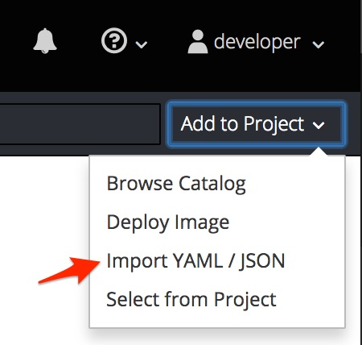

# RHSummit2018Camel3ScaleLab Developer Workspace Image

This directory defines a docker image that has all the developer tools and build time 
dependencies pre-installed so that a user does not need to install any tooling to get 
started with this lab.

To use it, select the *Add to Project* menu option in the OpenShift console 

and paste the following text into the text box:

    apiVersion: batch/v1
    kind: Job
    metadata:
      name: workspace
    spec:
      template:
        spec:
          containers:
          - name: workspace
            image: chirino/rhsummit2018camel3scalelab
            command: ["/bin/bash", "-c", "sleep 10000000000000000"]
          restartPolicy: Never

This should start up a workspace pod, navigate to it via *Applications > Pods*, once 
selected go to the *Terminal* to find your CLI that will have all tools needed
to complete this lab:

* nano, vi, or emacs
* git, maven, and the oc client